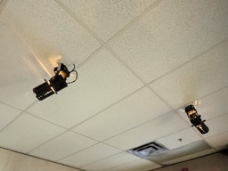
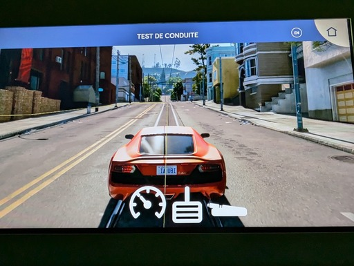

# Exposition au Centre des sciences

Le Centre des sciences à Montréal dans le vieux port de Montréal.

Durant ma visite du 31 janvier au Centre des sciences, j'ai pu explorer l'exposition intérieure permanente de « Explore - La science en grand ». L'un des dispositifs disponibles dans cette exposition était le dispositif d'Ubisoft.

## Intelligente, la conduite ?

Le dispositif d'Ubisoft « Intelligente, la conduite ? » comprend un dispositif intérieur permanent de type intéractif. L'utilisateur est invité à modifier plusieurs paramètres pour une intelligence artificielle contrôlant  la conduite d'une voiture. Après avoir finalisé ses réglages, l'utilisateur peut observer son résultat, en regardant une simulation de la voiture. Il obtint ensuite une « note » ou une fin, dépendamment du résultat et des réglages.

### Mise en espace

### Composantes et techniques

Le dispositif comporte un écran tactile et un écran sur le mur. L`écran tactile est connecté à un ordinateur pour que l'utilisateur envoie ses instructions, qui sera projeté sur l'écran mural. Il y a, sans doute, de multiples câbles cachés sous le le sol ou dans les murs, qui connectent l'écran tactile à l'écran mural.

Pour que le dispositif soit présentable, le Centre des sciences a dû fournir une salle et de l'éclairage au plafond.

## Mon expérience

Mon expérience de ce dispositif était assez positif. Il est plutôt simple, mais est executé de grande qualité dans le programme utilisé pour démontrer la conduite intelligente sur l'écran. Non seulement le visuel est beau, mais il est aussi intuitif et visuellement impressionnant.

Du côté de la visite, mon expérience de celle-ci était plaisante même si j'y ai déja été auparavant. J'ai grandement apprécié la section hydraulique de l'exposition. Cette eau est grandement satisfaisante à regarder, et le lien avec toute notre électricité produite par Hydro-Québec ajoute un lien tangible.

## Références
*Centre des sciences de Montréal.* (s. d.). Centre des Sciences de Montréal. https://www.centredessciencesdemontreal.com/

Année de réalisation inconnue.

