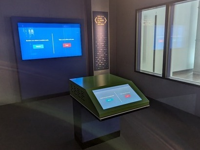

# Exposition au Centre des sciences

Le Centre des sciences à Montréal dans le vieux port de Montréal.

L'exposition intérieure permanente de « Explore - La science en grand » offre. L'un des dispositif disponibles dans cette exposition serait le dispositif d'Ubisoft.

Durant ma visite du 31 janvier au Centre des sciences,

## Intelligente, la conduite?

Le dispositif d'Ubisoft comprend un dispositif intérieur permanent de type intéractif.

### Mise en espace

### Composantes et techniques

Le dispositif comporte un écran tactile et un écran sur le mur.

Il y a, sans doute, de multiples cables cachés sous le le sol ou dans les murs, qui connectent l'écran tactile à l'écran mural.

## Mon expérience

Mon expérience de ma visite était plaisante.

## Références
*Centre des sciences de Montréal.* (s. d.). Centre des Sciences de Montréal. https://www.centredessciencesdemontreal.com/

Année de réalisation inconnue.

