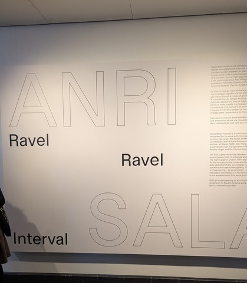

# Musée des beaux-arts de Montréal

Le Musée des beaux-arts de Montréal exposait temporairement l'une des œuvres de Anri Sala: « Ravel Ravel Interval ».

 

## Anri Sala: Ravel Ravel Interval

Ravel Ravel Interval est une œuvre consistant de deux projections sur deux toiles et des haut-parleurs dans une pièce, montrant une symphonie musicale. Une vidéo de quelqu'un jouant le piano avec une main est projetée sur deux toiles qui peuvent se superposer selon le point de vue des visiteurs. Cette pièce musicale a été composé par un pianiste ayant perdu son bras droit durant la Première guerre mondiale, étant représenté dans les vidéos jouant.

 

### Mise en espace

 

### Composantes et techniques

L'œuvre fait usage de deux projections qui peuvent être superposés selon le point de vue des visiteurs. Ces deux projections sont à une certaine distance entre le milieu et le fond de la pièce. Plusieurs haut-parleurs sont dissimulés dans la pièce. Les projecteurs et les haut-parleurs sont sans doute connectés à un processeur capable de stocker et de jouer des fichiers vidéo et audio.

 

## Mon expérience

J'ai apprécié le fait qu'il était possible de regarder l'écran de plusieurs points de vue, que ce soit de coté, de voir les deux se superposés, ou de le voir en angle. Le thème était facile à comprendre avec l'affiche au départ et la main étant mise de l'avant durant les projections.

 

## Références

