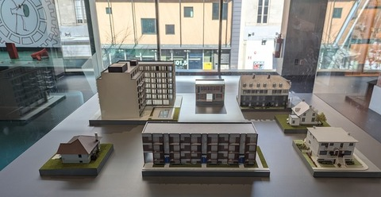
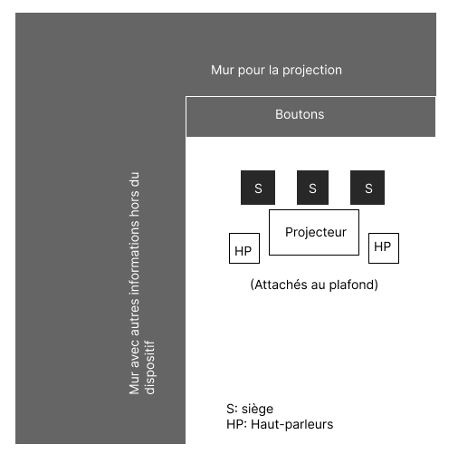
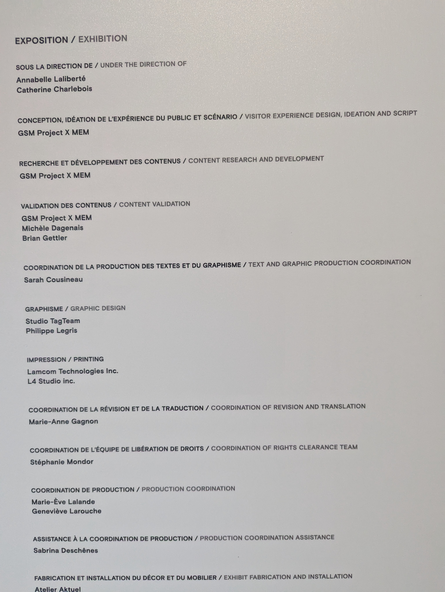

# Exposition « Montréal »

L'exposition « Montréal » du Centre des mémoires montréalaises offrait une expérience immersive et interactive unique de voyager à travers l'histoire de la ville à travers une multitude de dispositifs expliquant chaque aspect de la ville. Plusieurs dispositifs permettaient d'explorer plusieurs angles de la ville et de son histoire, de livres audio, artéfacts en présentoir, de grands écrans avec projections, cartes et maquettes sophistiqués.

 

## La Machine-ville

La Machine-ville se situe vers le milieu de l'exposition, après plusieurs autres dispositifs mais étant la première de 3 grandes projections majeures sur grand écran.

La Machine-ville est un dispositif permettant à l'utilisateur d'en connaitre plus sur certains sujets sur la ville de Montréal. Lorsque quelqu'un appuie sur sois le bouton français ou anglais, une vidéo est projetée par un projecteur sur le mur et les haut-parleurs commencent la narration. Ces boutons sont près de certains objets thématiques attachés à la « console » du dispositif. Les options portaient sur les sujets du téléphone, des élections municipales, du service postale et du porte-voix.

 

### Mise en espace

 

### Composantes et techniques

Un projecteur et deux haut-parleurs se situent au-dessus du dispositif. Le projecteur sert à projeter une vidéo sur le mur, tandis que les haut-parleurs projettent du son. Ces composantes sont surement connectées à un processeur derrière capable de de stocker de l'information et faire jouer une vidéo avec du son.

 

## Appréciation

Le dispositif était simple à utiliser, étant adapté pour des enfants, et ses instructions pour l'utiliser étaient claires et précises. La vidéo qui jouait était informative et l'ajout de bancs coussinés qui peuvent être bougés était une bonne addition. Ce que je ferais différemment serait d'ajouter plus d'options d'interactivités pour rendre le dispositif plus dynamique, comme beaucoup d'autres dispositifs à cette exposition sont très passifs.

ADD LIEN

 

## Références

