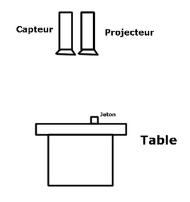
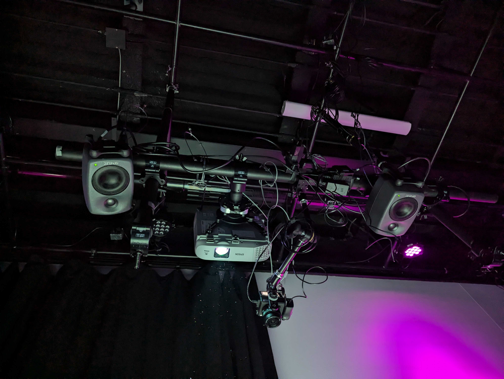

# Etheria

Etheria est mon projet finissant préféré parmi ceux de l'exposition temporaire « Résonnance ». Nous avons visité les projets finissants en cours le 25 février 2025. L'équipe travaillant sur Etheria est composé de Maik Hamel, Michael Un Dupré, Victor Gileau, Joshua Gonzalez-Barrera et Pierre-Luc Proulx.

Etheria est un jeu vidéo interactif projeté sur une table, se jouant avec plusieurs joueurs. Chaque joueur peut choisir et utiliser un « jeton » pour contrôler un personnage pouvant attaquer plusieurs ennemis. L'objectif du jeu est de protéger un point au centre de la table. Chaque « jeton » représente un personnage différent avec des attaques différentes

 

## Mise en espace

Etheria requiert un espace pour une table, un projecteur par-dessus et un espace pour le matériel qui supportera le logicial pour le jeu qui sera projeté.

 

## Composantes et techniques

Etheria utilise divers projecteurs au-dessus d'une table pour projeter le jeu sur cette dernière. Les projecteurs sont connectés à une console avec le programme pour faire jouer le jeu. Chaque « jeton » est un objet avec un symbol sur le dessus pour qu'il soit reconnu par le projecteur, transmettant les données de positionement au logiciel..

 

## Mon expérience

J'ai grandement apprécié l'interactivité physique du jeu, même si elle était imparfaite car le projet était encore en cours. La coordination requise entre plusieurs utilisateurs est bien pensée et le jeu est assez amusant.

 

## Références

*Etheria.* (s. d.). https://ethereal-creators.github.io/Etheria/#/