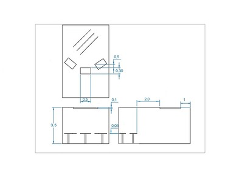

# Projets finissants - Résonnance

## CON DU8

CON DU8 est un projet finissant créé par Ian Corbin, Samuel Desmeules Voyer, Alexandre Gervais, Kevin Malric et Jérémy Roy Coté

### Installation et schéma

L'installation provisoire de CON DU8 comportait un vélo, un projecteur et une console pour supporter le logiciel requis. Le tout étant interconnecté par de divers cables.

### Mon expérience

CON DU8 est une expérience intéréssante, amenant les gens à faire plus de cardio, en liant la vitesse d'un vélo dans une course dans un jeu vidéo à un vrai vélo. La plupart des gens peuvent seulement réussir une des trois courses prévues avec le cardio d'une personne non-entrainée.

### Cours incontournables

- Interactivitié ludique
- Modélisation 3D
- Objets interactifs

## Arcadia

Arcadia est un projet finissant créé par Dominic Yale, William Beauvais et Anton Nikulin.

### Installation et schéma

L'installation d'Arcadia comprenait leur jeu vidéo dans une borne d'arcade classique, avec un joystick et des boutons.

### Mon expérience

Arcadia est un jeu vidéo de plateforme avec assez de contenu: la quête principale étant de partir à la recherche de certain objecs. Les obstacles principaux étaient les ennemis présents et les plateformes de saut. Ces derniers étaient assez frustant comme les attaques du joueur semblaient impuissantes et il fallait recommencer plusieurs fois sur plusieurs parcours en hauteur. 

### Cours incontournables

- Interactivitié ludique
- Illustration numérique
- Objets interactifs

## Fuga

Fuga est un projet finissant créé par Abdel Ali Djeral, Daniel Dezemma, Matis Labelle, Tristan Khadka et Yavuz-Selim Gucluer.

### Installation et schéma

L'installation de Fuga comprenait quatre écrans, des curseurs pour controller l'apparance des arbres et de nombreux cables pour connecter le tout à une console qui supporte le logiciel requis.

### Mon expérience

Il était assez satisfaisant de voir les arbres grandissants et pouvoir les modifiers par leur feuillage et branches. Par contre, j'ai l'impression qu'il y aurait pu avoir plus d'options différentes disponibles.

### Cours incontournables

- Interactivitié ludique
- Modélisation 3D
- Objets interactifs

## Luminatura

Luminatura est un projet finissant créé par Audrey Dandurand, Justine Rousseau, Camilia Bouatmani, Prethiah Rajaratnam et Ihab Mouhajer.

### Installation et schéma

L'installation de Luminatura comportait des projecteurs et trois plaques de métal pour intéragir avec la projection.

### Mon expérience

L'animation 3D projeté était très bien réalisé et magnifique à regarder.

### Cours incontournables

- Installation multimédia
- Animation 3D
- Objets interactifs

## Internature

Internature est un projet finissant créé par Kenza El Harrif, Isaac Fafard, Delphine Grenier, Khaly Tia Sing et Sitmonternna Yi.

### Installation et schéma

L'installation de Internature comportait une large serre étant un cylindre ouvert avec des projections sur les murs. Une sphère dans le milieu permettait d'intéragir avec les projections.

### Mon expérience

Les patternes projetés était très bien réalisé et magnifique à regarder.

### Cours incontournables

- Installation multimédia
- Animation 3D
- Objets interactifs

## Prismatica

Prismatica est un projet finissant créé par Ikrame Rata, Jérémy Duverseau et Vincent Delisle.

### Installation et schéma

L'installation de Prismatica comportait une table avec une caméra de détection au dessus, et un projecteur mural.

### Mon expérience

Il était intéressant et amusant de dessiner durant cette expérience et d'entendre une mélodie.

### Cours incontournables

- Installation multimédia
- Traitement audiovisuel
- Objets interactifs

## Nouvelle technique

La nouvelle technique la plus intéréssante que j'ai appris au cours de cette exposition était celle de la reconnaissance visuelle d'un capteur. Par example, Etheria utilisait cette technique pour détecter les jetons des joueurs pour visualiser la position du joueur dans le jeu. Le capteur reconnaisait un patterne spécifique imprimé en noir et blanc dans ce cas, ressemblant à un code QR.

## Références

[Résonnance]https://tim-montmorency.com/2025/#/

[Prismatica]https://pootpookies.github.io/Prismatica/
[CON DU8]https://gearshift-games.github.io/Web-C0N-DU8/#/
[Luminatura]https://miaou-mafia.github.io/projet-luminatura/#/
[Etheria]https://ethereal-creators.github.io/Etheria/#/
[Fuga]https://escapism-fuga.github.io/Fuga/#/
[Internature]https://tprangers.github.io/internature/
[Arcadia]https://cousi-cousa.github.io/Arcadia/#/