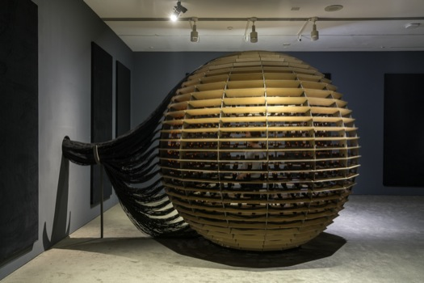
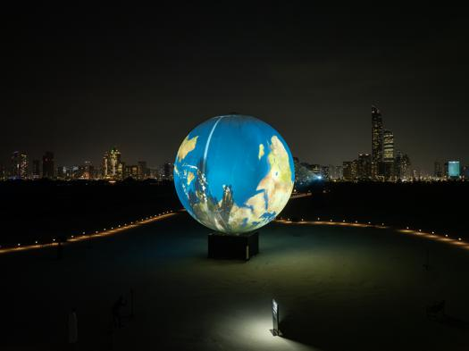

# Résumé de la conférence de Jade Seguela

Jade Seguela est une registraire chez l'atelier Rafael Lozano-Hemmer. Rafael Lozano-Hemmer est un artiste mexicain-canadien. Son domaine était, à la base, celui des sciences, avant de devenir un artiste d'œuvre interactives. C'est ce que son atelier produit. Durant sa conférence du 25 mars 2025, Jade Seguela expliquait le fonctionnement du studio derrière plusieurs œuvres exposés partout dans le monde et la logistique demandé pour réaliser et exposer quelque de ces œuvres. Chacune de ces œuvres a besoin d'un travail complet de recherche, production, conservation et exposition.

## *Sphere Packing: Bach*

*Sphere Packing: Bach* est une œuvre réunissant toutes les compositions musicales de Johann Sebastian Bach, concentrés dans une seule sphère avec 1128 haut-parleurs chacun jouant une de ses pièces. Les personnes dans la sphère sont bombardées par tous les sons jouant en même temps, créant une expérience unique. Jade Seguela expliquait comme la complication du projet était le branchement des câbles derrière la sphère pour pouvoir faire jouer toute la musique.

## *Shadow Tuner*

Le *Shadow Tuner* est une œuvre faisant partie de l'exposition « Translation Island* » à Abu Dhabi de novembre 2023 à janvier 2024. Une carte de la terre est projetée sur une grande sphère pour former un massif globe terrestre. Lorsque des gens passent en face de la projection, ces personnes peuvent recouvrirent certaines parties du monde. Dépendamment de la zone ombragée, le son de différentes stations de radios des quatre coins de la planète jouait. Jade Seguela expliquait comme assembler l'œuvre était d'une grande difficulté comme elle était situé sur une île artificielle isolée, à la merci des éléments de la nature comme la pluie ou les animaux. Il y avait également un seul bateau qui passait apporter et rapporter les travailleurs, le matin et le soir.

## Conclusion

Bref, l'atelier Rafael Lozano-Hemmer produit des œuvres interactives multimédias qui sont exposés à travers le monde. Chacune de ces œuvres, comme le *Shadow Tuner* ou *Sphere Packing: Bach* demandent une grande logistique derrière leur production et assemblage, comme Jade Seguela a expliqué durant la conférence du 25 mars 2025. J'ai apprécié qu'une registraire de ce studio a pu venir nous expliquer en détail et en toute authenticitié le processus derrière ces oeuvres, comme elle a participé personellement.

## Références

*Rafael Lozano-Hemmer* - *Rafael Lozano-Hemmer : Sphere Packing: Bach.* (s. d.). https://www.lozano-hemmer.com/sphere_packing_bach.php
*Rafael Lozano-Hemmer* - *Rafael Lozano-Hemmer : Shadow Tuner.* (s. d.). https://www.lozano-hemmer.com/shadow_tuner.php